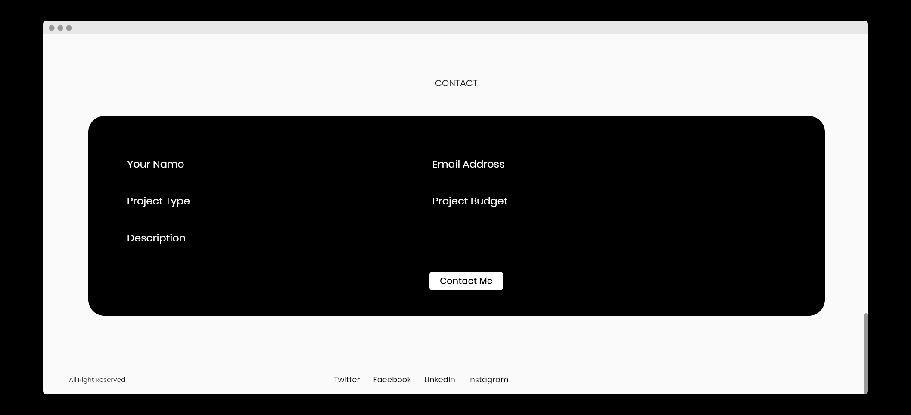

# Flutter Web Landing Page UI

Let's create awesome fully responsive landing page using flutter, first of all you need to enable flutter web support by following below link. We use Flutter MediaQuery to make this UI Responsive on Mobile, Tab & Desktops.
# Live Here
[Click Here](https://folio-cbfc8.web.app/#/)
## Not functioning properly in Mobile Screens
# Mocks

